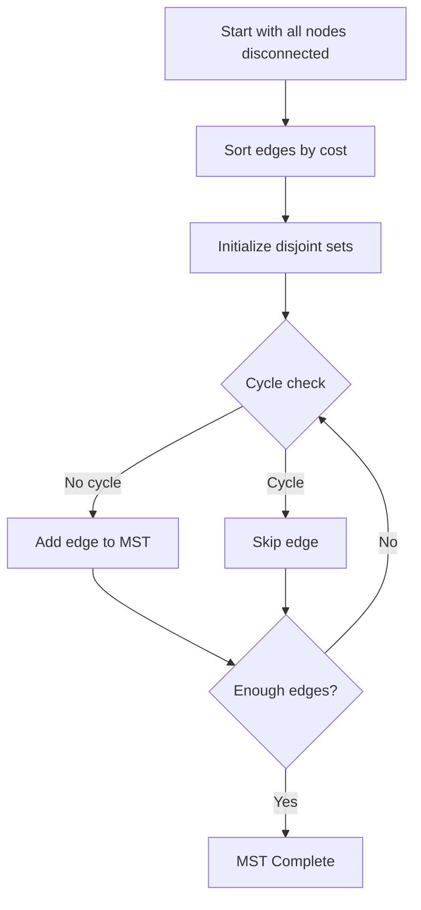

# 🚚 Supply Chain Optimization using Kruskal's Algorithm

This project applies **Kruskal's Minimum Spanning Tree (MST) algorithm** to optimize a supply chain network between key Indian cities. It demonstrates how graph-based algorithms can minimize transportation costs while ensuring full connectivity without cycles. The problem is modeled as a weighted undirected graph where nodes represent cities and edges represent costed transport routes.

---

## 📦 Problem Statement

Minimize transportation cost between Indian cities in a supply chain network while ensuring every node (city) remains connected using the most efficient set of edges (routes). This is achieved by constructing an MST.

---

## 🧮 Data Overview

| From       | To          | Cost (INR) |
|------------|-------------|------------|
| Delhi      | Mumbai      | 45,322     |
| Delhi      | Bangalore   | 25,678     |
| Mumbai     | Bangalore   | 15,070     |
| Mumbai     | Kolkata     | 79,800     |
| Bangalore  | Chennai     | 33,497     |
| Chennai    | Kolkata     | 25,669     |
| Chennai    | Hyderabad   | 48,990     |
| Kolkata    | Hyderabad   | 17,800     |

- **Total Cities**: 6
- **Total Routes (Edges)**: 8
- **Graph Type**: Undirected, Weighted

---

## 🔗 Algorithm: Kruskal’s MST

### Steps:
1. Sort all edges by cost (ascending)
2. Initialize each city as its own disjoint set
3. Iterate over sorted edges and add edge if it doesn’t create a cycle (Union-Find method)
4. Stop when MST contains exactly `V - 1` edges (for `V` cities)

---

## 📈 Diagram: Kruskal Algorithm Flow

---
### Time Complexity:
- Sorting edges: **O(E log E)**
- Union-Find operations: **O(E log V)**

---

## 🔍 Exploratory Data Analysis (EDA)

- **Min cost edge**: Mumbai – Bangalore → ₹15,070
- **Max cost edge**: Mumbai – Kolkata → ₹79,800

Visuals created using `networkx` show clearly marked MST edges in red with edge weights.

---

## ✅ Key Results

| MST Edge                | Cost (INR) |
|-------------------------|------------|
| Mumbai – Bangalore      | 15,070     |
| Delhi – Bangalore       | 25,678     |
| Chennai – Kolkata       | 25,669     |
| Kolkata – Hyderabad     | 17,800     |
| Bangalore – Chennai     | 33,497     |

**Total MST Cost**: ₹117,714

✅ All 6 cities connected with minimum cost
✅ No cycles formed

---

## 🚀 Future Enhancements

- 🔄 Dynamic data input (CSV, Excel, API)
- 🌐 Interactive geographic mapping
- 🧠 ML cost prediction integration
- ⛔ Constraints like capacity, time, and real-time road conditions
- 📡 Real-world logistics API integration

**Optimizing India's supply routes with classic algorithms.**
